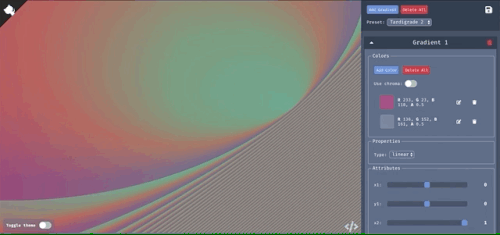

# SVG Gradient Editor 🌈 🖌

Create, save and download SVG gradients

Create
- using native web features
- and/or using awesome Gregor Aisch's [chroma.js](https://github.com/gka/chroma.js) library
- by applying blend modes [Work in progress]

Save as:
- a preset object in local storage
- a svg file on your computer

## Installation and starting in local environment

- `yarn install`
- `yarn start`
