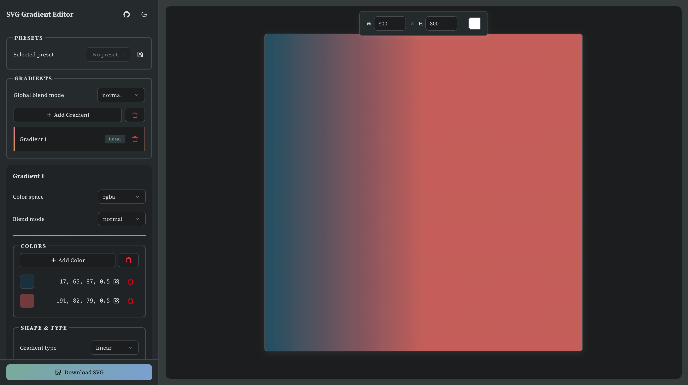

# SVG Gradient Editor 🌈 🖌

A fully client-side React app for creating, editing, and exporting SVG gradients.



## Features

- Create linear and radial SVG gradients with a visual editor
- Advanced color interpolation via [chroma.js](https://github.com/gka/chroma.js) — 10 color spaces (rgb, hsl, lab, oklch, etc.) with linear and bezier modes
- Theme-agnostic artboard with customizable background color
- Save gradients as presets in local storage
- Download as SVG files
- Starts with a random gradient for instant inspiration

## Tech Stack

- **React 19** with **Jotai** for state management
- **Vite 8** + **TypeScript 6**
- **Tailwind CSS 4** with **shadcn/ui** (Radix UI) components
- **Web Worker** for non-blocking color interpolation
- **Bun** as package manager

## Getting Started

```bash
bun install
bun run dev
```

## Scripts

| Command | Description |
|---------|-------------|
| `bun run dev` | Start dev server with hot reload |
| `bun run build` | Production build (outputs to `./dist`) |
| `bun run serve` | Preview production build locally |
| `bun run lint` | Lint with oxlint |
| `bun run format` | Format with oxfmt |
